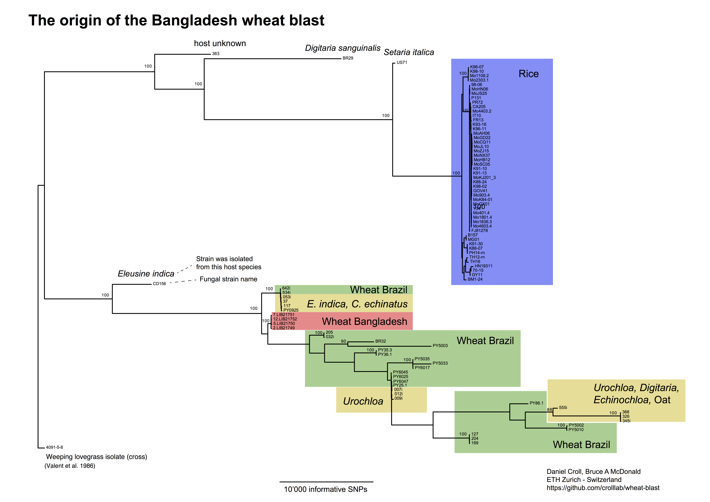

Update 29 April 2016: The Open Wheat Blast website shared a [timeline](http://s620715531.websitehome.co.uk/owb/?p=485) of the recent developments.

Update 28 April 2016: [Nature News](http://www.nature.com/news/devastating-wheat-fungus-appears-in-asia-for-first-time-1.19820) article about the wheat blast outbreak.


The origin of wheat blast in Bangladesh
================================


What is wheat blast? Is it dangerous?
------------------------------------
Wheat blast is a fungal disease that leads to large yield losses. You can find some more information at [Open Wheat Blast](http://wheatblast.net) and from [Kansas State University ](https://www.k-state.edu/wheatblast/)


What happened in February 2016?
------------------------------------
Wheat blast was first found in Bangladesh. This was the first report of the disease in Asia. The disease already caused large yield losses and there is a significant worry that the disease will rapidly spread to wheat production areas in India and beyond. 


Why was there an outbreak of wheat blast in Bangladesh?
------------------------------------
Currently, nobody knows. The key question is whether wheat blast was introduced to Bangladesh from elsewhere or whether it originated locally (e.g. through natural mutations in local fungal strains).

Wheat blast and rice blast are closely related pathogen lineages and currently identified as one species. All rice blast pathogen strains are genetically very similar. Wheat blast pathogen strains are genetically diverse and distinct from rice blast, as shown [here]( http://www.slideshare.net/BruceMcDonald234/mcdonaldwheatblastasilomarfungalgenetics2015).


Who are we?
------------------------------------
We are plant pathologists at the ETH Zurich (Switzerland) using genomics tools to identify how plant pathogens cause disease. You can read more about Daniel Croll's research [here](http://www.pathogen-genomics.org) and Bruce McDonald's research [here](http://www.path.ethz.ch/the-group.html).


How do we find out where wheat blast came from?
------------------------------------
We analyzed genome datasets generated around the world for rice and wheat blast strains. Though the rice blast strains came from many countries, all wheat blast strains came from Brazil. If the wheat blast strains found in Bangladesh are closely related to previously known strains, we can identify the likely source of the Bangladesh outbreak.


What data did we use?
------------------------------------
The key piece of information was gathered by the teams of Sophien Kamoun at [The Sainsbury Laboratory](http://www.tsl.ac.uk), Diane Saunders [The Genome Analysis Centre (TGAC)](http://www.tgac.ac.uk), and Tofazzal Islam of the [Bangabandhu Sheikh Mujibur Rahman Agricultural University](http://bsmrau.edu.bd). These teams collected infected leaves from the field, sequenced a significant portion of the pathogen's genome and made the data instantly [available](http://s620715531.websitehome.co.uk/owb/?page_id=282).

Then, we added rice and wheat blast data from multiple sources including publicly available genomes on [NCBI](http://www.ncbi.nlm.nih.gov/genome/?term=magnaporthe+oryzae) and genomes [available](http://s620715531.websitehome.co.uk/owb/?page_id=278) from Nick Talbot and Darren Soanes (Exeter University).

We also generated our own genome sequence data. Paulo Ceresini’s group including Vanina Castroagudin (UNESP, Brazil) and João Nunes Maciel (EMBRAPA Wheat, Brazil) collected wheat blast strains across Brazil. Bruce McDonald and Daniel Croll (both ETH Zurich) generated genome sequencing data. We made the genome sequence of a Brazilian wheat blast strain available. Download the [genome](https://www.dropbox.com/s/oh8942swth5f7pe/WheatBlast_205_Brazil.fa?dl=0), [gene models](https://www.dropbox.com/s/7exq3kj2k0zhb7u/WheatBlast_205_Brazil.gff?dl=0) and [protein sequences](https://www.dropbox.com/s/057hth1sdxzldij/WheatBlast_205_Brazil.proteins.fa?dl=0).


What did we find out?
------------------------------------------

1. The wheat blast outbreak in Bangladesh was not caused by a mutated rice blast strain. We found that the strains isolated from Bangladesh grouped very tightly with all known wheat blast strains from Brazil and not with any known rice blast strains.

2. The wheat blast strains in Bangladesh are genetically very similar to wheat blast strains previously identified in Brazil. The genetically most similar strains were collected in Brazilian wheat fields and on associated weeds Eleusine indica (goose grass) and Cenchrus echinatus collected in Brazil.

3. One of the genetically closest strains known from Brazil is PY0925. The genome sequence and annotation can be downloaded [here](http://s620715531.websitehome.co.uk/owb/?page_id=278). We made the genome sequence of an additional Brazilian wheat blast strain available. This is strain 205 isolated in São Borja (RS, Brazil) and is slightly more distant to the Bangladesh blast strains. Download the [genome](https://www.dropbox.com/s/oh8942swth5f7pe/WheatBlast_205_Brazil.fa?dl=0), [gene models](https://www.dropbox.com/s/7exq3kj2k0zhb7u/WheatBlast_205_Brazil.gff?dl=0) and [protein sequences](https://www.dropbox.com/s/057hth1sdxzldij/WheatBlast_205_Brazil.proteins.fa?dl=0).

4. The high similarity among the wheat blast strains from Bangladesh and Brazil suggests that wheat blast was introduced into Bangladesh from Brazil. Many fungal diseases can be transmitted via grains and previous research indicated that wheat blast can be seed-transmitted. A transmission of the disease from Brazil is plausible because Bangladesh is one of the largest Asian importers of wheat and Brazil is one of the [major suppliers of wheat to Bangladesh]( https://translate.google.com/translate?sl=auto&tl=en&js=y&prev=_t&hl=en&ie=UTF-8&u=http%3A%2F%2Fwww.serragraos.com.br%2F20072015-brasil-exporta-mais-trigo-para-depois-ter-que-importar&edit-text=&act=url).

5.  Other Asian countries that received wheat from Brazil, including [Thailand, Philippines and Vietnam]( https://translate.google.com/translate?sl=auto&tl=en&js=y&prev=_t&hl=en&ie=UTF-8&u=http%3A%2F%2Fwww.serragraos.com.br%2F20072015-brasil-exporta-mais-trigo-para-depois-ter-que-importar&edit-text=&act=url) should increase surveillance efforts to learn if wheat blast has entered into their wheat fields.




Figure - wheat and rice blast: We constructed a maximum likelihood phylogeny of all available rice and wheat blast genome sequences. The samples included 47 rice blast strains, 32 Brazilian blast strains, 5 strains from various additional hosts and 4 samples collected in Bangladesh in spring 2016. The dataset contained only SNPs reliably called in the transcriptomic sequences of the Bangladesh sample 12 and genotyped in at least 90% of all other strains. We retained 55'041 informative SNPs. The phylogeny was constructed using RAxML version 8.2.8 with a GTR substitution matrix and 100 bootstrap replicates. 


Figure - Brazilian and Bangladesh wheat blast: We assessed phylogenetic relationships among Brazilian (n=32) and Bangladesh (n=4) blast strains using a Neighbor-Net. The dataset contained only SNPs reliably called in the transcriptomic sequences of the Bangladesh sample 12 and genotyped in at least 90% of all other strains. We retained 7411 informative SNPs. We performed the analysis using splitsTree version 4.14.2. Phylogenetic distances are uncorrected p distances.


What are the genome sequences of the most closely related Brazilian wheat blast strains?
------------------------------------
One of the most closely related genomes is [available](http://s620715531.websitehome.co.uk/owb/?page_id=278) from Nick Talbot and Darren Soanes (Exeter University). This is strain PY0925 isolated in Perdizes (MG, Brazil) in 2009.

We made  the genome sequence of an additional Brazilian wheat blast strain available. This is strain 205 isolated in São Borja (RS, Brazil) and is slightly more distant to the Bangladesh blast strains. Download the [genome](https://www.dropbox.com/s/oh8942swth5f7pe/WheatBlast_205_Brazil.fa?dl=0), [gene models](https://www.dropbox.com/s/7exq3kj2k0zhb7u/WheatBlast_205_Brazil.gff?dl=0) and [protein sequences](https://www.dropbox.com/s/057hth1sdxzldij/WheatBlast_205_Brazil.proteins.fa?dl=0).


How did we analyze the data?
------------------------------------
We used standard bioinformatic procedures to analyze genomic sequences. The most important steps are detailed below.

We performed all analyses using the genome of the rice blast strain 70-15 as a reference. The genome sequence is available at [Ensembl Fungi](http://fungi.ensembl.org/Magnaporthe_oryzae/Info/Index).


**Alignment of sequencing data against the reference genome**

For all completely sequenced genomes, we aligned quality-trimmed Illumina short read data against the reference genome. We used [bowtie2](http://bowtie-bio.sourceforge.net/bowtie2/index.shtml).

```shell
bowtie2 --very-sensitive-local \
	--phred33 -x reference-genome-index \
	-1 R1.fq.gz -2 R2.fq.gz -X 1000 \
	-S alignedreads.sam
```


For all strains collected from the outbreak, an approach called ["Field pathogenomics"](http://genomebiology.biomedcentral.com/articles/10.1186/s13059-015-0590-8) was used (see above). This data represents transcriptome sequences (RNA) and must be analyzed differently than complete genome sequencing data. We used the RNA-seq aligner [tophat2](https://ccb.jhu.edu/software/tophat/index.shtml).

```shell
tophat -G reference.gff --min-intron-length 10 \
   --rg-id strain.id --rg-sample strain.id --rg-library strain.id \
   --keep-fasta-order --output-dir strain.id \
   reference-genome-index R1.fq.gz R2.fq.gz
```


**Raw variant calling using the Genome Analysis Toolkit GATK**

We identified variants in the genomes of the different strains using the Genome Analysis Toolkit (GATK) from the [Broad Institute](https://www.broadinstitute.org/gatk/).

*Completely sequenced genomes*

Perform variant calling using the GATK HaplotypeCaller.

```shell
java -Xmx8g -jar GenomeAnalysisTK.jar \
	-T HaplotypeCaller \
	-R reference-genome.fa \
	-ploidy 1 \
	--input_file alignedreads.bam \
	--emitRefConfidence GVCF \
	--variant_index_type LINEAR \
	--variant_index_parameter 128000 \
	-o alignedreads.g.vcf
```

*Bangladesh strains (Field pathogenomics)*

To prepare the aligned reads from tophat for variant calling.

```shell
java -Xmx8g -jar GenomeAnalysisTK.jar \
	-T SplitNCigarReads \
   -R reference-genome.fa -I RawData/$seqid/accepted_hits.bam -o RawData/$seqid/accepted_hits.cigarN.bam \
   -rf ReassignOneMappingQuality -RMQF 255 -RMQT 60 \
   -U ALLOW_N_CIGAR_READS
```


Perform variant calling using the GATK HaplotypeCaller.

```shell
java -Xmx8g -jar GenomeAnalysisTK.jar \
	-T HaplotypeCaller \
	-R reference-genome.fa \
	-ploidy 1 \
	--input_file alignedreads.bam \
	--emitRefConfidence GVCF \
	--variant_index_type LINEAR \
	--variant_index_parameter 128000 \
	-o alignedreads.g.vcf
```


**Joint variant calling and filtration using the Genome Analysis Toolkit GATK**

We generated a joint variant call set using the GATK GenotypeGVCFs.

```shell
java -Xmx35g -jar GenomeAnalysisTK.jar \
	-T GenotypeGVCFs \
	-R reference-genome.fa \
	--variant g.vcf.list \
	-maxAltAlleles 2 \
	-o genotyped.vcf
```

We removed all non-SNP variants.

```shell
java -Xmx16g -jar ~/software/$GATKVERSION/GenomeAnalysisTK.jar \
	-T SelectVariants \
	-R reference-genome.fa \
	-selectType SNP \
	--variant genotyped.vcf \
	-o genotyped.snp-only.vcf
```

Finally, we applied several hard filters to remove low-quality SNPs.

```shell
QUAL=5000.0

QD=5.0
MQ=20.0
ReadPosRankSum_lower=-2.0
ReadPosRankSum_upper=2.0
MQRankSum_lower=-2.0
MQRankSum_upper=2.0
BaseQRankSum_lower=-2.0
BaseQRankSum_upper=2.0

java -jar ~/software/$GATKVERSION/GenomeAnalysisTK.jar \
	-T VariantFiltration \
	-R reference-genome.fa \
	--variant genotyped.snp-only.vcf \
	--filterExpression "AN < $AN" --filterName "nSamples" \
	--filterExpression "QD < $QD" --filterName "QDFilter" \
	--filterExpression "QUAL < $QUAL" --filterName "QualFilter" \
	--filterExpression "MQ < $MQ" --filterName "MQ" \
	--filterExpression "ReadPosRankSum < $ReadPosRankSum_lower" --filterName "ReadPosRankSum" \
	--filterExpression "ReadPosRankSum > $ReadPosRankSum_upper" --filterName "ReadPosRankSum" \
	--filterExpression "MQRankSum < $MQRankSum_lower" --filterName "MQRankSum" \
	--filterExpression "MQRankSum > $MQRankSum_upper" --filterName "MQRankSum" \
	--filterExpression "BaseQRankSum < $BaseQRankSum_lower" --filterName "BaseQRankSum" \
	--filterExpression "BaseQRankSum > $BaseQRankSum_upper" --filterName "BaseQRankSum" \
	-o genotyped.snp-only.filters.vcf
```


**Selection of SNPs for phylogenomic analyses using vcftools**

We used [vcftools](https://vcftools.github.io) to generate a SNP dataset for phylogenomic analyses. To avoid biases in the phylogenetic reconstruction, we only retained SNPs that were called in at least 90% of all analyzed strains. Furthermore, we retained a SNP only if the SNP was called in the best sequenced Bangladesh [sample 12](http://s620715531.websitehome.co.uk/owb/?page_id=282).

```shell
vcftools --vcf genotyped.snp-only.filters.vcf \
	--positions bangladesh_snps.txt
	--max-missing 0.9 --remove-filtered-all --recode \
	--out genotyped.snp-only.filters.subset.vcf
```


**Phylogenomic analyses using RAxML and Splitstree**

We built a phylogenetic tree from a SNP supermatrix using [RAxML version 8.2.8](http://www.exelixis-lab.org). For detailed parameters see above.

We also constructed a NeighborNet among all wheat blast strains using [splitsTree version 4.14.2](http://www.splitstree.org). For detailed parameters see above.

